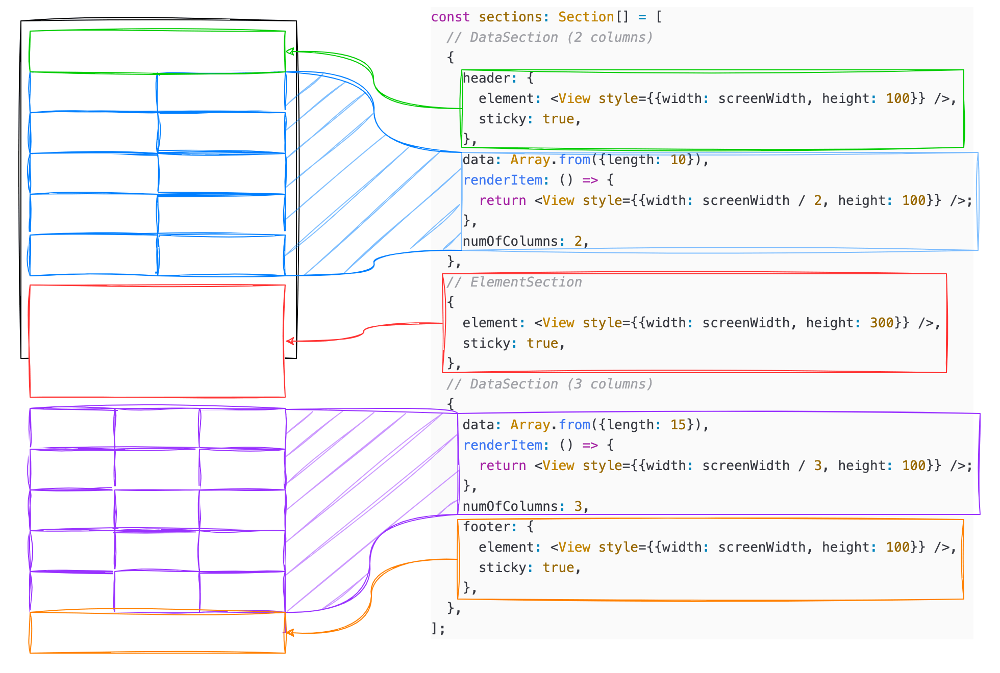

# flash-section-list

The library, which is dependent on `@shopify/flash-list`, overrides the [`overrideItemLayout` function internally](./src/FlashSectionList.tsx#L443-474) to ensure that sections with different `numOfColumns` are rendered properly.

Additionally, for enhanced performance, the library also [overrides the `getItemType` function internally](./src/FlashSectionList.tsx#L412-L442) based on the type information of the section and the header or footer.

You can [set `sticky` properties](./example/src/App.tsx#L33-L77) not only for section items but also for footers or headers.

```ts
interface ElementSection {
  element: React.ReactElement | null;
  sticky?: boolean;
  type?: string;
  size?: number;
}

interface DataSection<ItemT> {
  data: ItemT[];
  renderItem: ListRenderItem<ItemT>;
  type?: string; // <- default: sectionIndex
  header?: ElementSection;
  footer?: ElementSection;
  stickyHeaderIndices?: number[];
  numOfColumns?: number;
  itemSize?: number;
  gap?: number;
}
```

## Example

### Simple

[./example/src/App.tsx](./example/src/App.tsx)

### Complex (with NestedScrollView and TabView)

https://github.com/JoonDong2/flash-section-list-example

## Installation

```sh
npm install @shopify/flash-list flash-section-list
```

## Usage

```js
import FlashSectionList, { type Section } from 'flash-section-list';
import { Dimensions, View } from 'react-native';

const screenWidth = Dimensions.get('screen').width;
```



```js
export default function App() {
  return <FlashSectionList estimatedItemSize={110} sections={sections} />;
}
```

### Type

The `type` of a Section refers to the type that will be applied to all items, excluding the `header` and `footer`.

By default, the `index` of the Section is used. However, if items in different Sections share the same type, you may use the same type for them. (e.g., [Example](./example/src/App.tsx#L28-L50))

It's recommended to use the same type for items with the same structure to encourage optimal reuse.

### scrollToSection

You can use the methods exposed by `FlashList`, and additionally, the `scrollToSection` method is available.

```js
import FlashSectionList, { type FlashSectionListHandle } from 'flash-section-list';
import { useRef, useEffect } from 'react';

export default function App() {
  const ref = useRef<FlashSectionListHandle>(null);

  useEffect(() => {
    setTimetout(() => {
      ref.current?.scrollToSection({ sectionIndex: 1 });
    }, 1000);
  }, []);

  return (
    <FlashSectionList ref={ref} {/* ... */} />
  );
}
```

## Known Issues

### Item Type

The `data` for each section may differ, and the type of the item property in each section's `renderItem` cannot be inferred correctly.  
Therefore, you must manually cast the types.

```js
interface Item {
  id: number;
}

const sections =[{
  data: Array.from({length: 10}).map((_, index) => ({id: index})),
  renderItem: ({item}: {item: Item}) => <View />
}]
```

### Sections

This library [parses the `sections` array whenever it changes.](./src/FlashSectionList.tsx#L133-L223)  
Therefore, you should avoid changing the sections array.

### Blank

When `numOfColumns` is set to 3 and there are 5 items, an empty space will occur in the second row.

If this empty space is not physically filled, the next row will move up, causing an alignment issue.

To resolve this, [I wrap the item with a View and use the `onLayout` of that View to calculate the size of the blank space.](./src/FlashSectionList.tsx#L394-L409)

To fully take advantage of reusability, I didn't limit the wrapping to just the last item.

As a result, in each section, item heights must be the same in vertical list. (The opposite applies for horizontal list)

### Screen Jitter

There is sometimes an issue in the iPhone simulator where the screen shakes when scrolling to the edges.

This issue was not observed on the Android emulator, or on actual iPhone and Android devices.

### Observable

This library can be used with[`react-native-observable-list`](https://www.npmjs.com/package/react-native-observable-list) to observe the visibility of items.

```js
import {Dimensions, View} from 'react-native';
import {
  type Section,
  FlashSectionListBuilder,
} from 'flash-section-list';
import {observe, useInViewPort} from 'react-native-observable-list';

const screenWidth = Dimensions.get('screen').width;

const builder = FlashSectionListBuilder();
const ObservableList = observe(FlashList);
builder.setFlashList(ObservableList);
const ObservableFlashSectionList = builder.build();

const Header = () => {
  useInViewPort(() => {
    console.log('visible');
    return () => {
      console.log('disappear');
    };
  }, []);
  return <View style={{width: screenWidth, height: 300, backgroundColor: 'tomato'}} />;
};

const sections: Section[] = [
  {
    header: <Header />,
    // data, renderItem, ...
  },
  // or
  {
    element: <Header />,
  }
]
```

### Scroll Indicator Position

`flash-list` internally sets the [`forceNonDeterministicRendering` property of `recyclerlistview`](https://github.com/Shopify/flash-list/blob/v1.7.1/src/FlashList.tsx#L367) to true.

Because of this property, the layout of the items is recalculated every time, so the size and position of the scroll indicator are unstable.

To solve this problem, you can use [the `size` and `itemSize` properties of Section.](./src/FlashSectionList.tsx#L468-L472)

The size is applied to the `height` in a vertical list, or to the `width` in a horizontal list.

## License

MIT

---

Made with [create-react-native-library](https://github.com/callstack/react-native-builder-bob)
